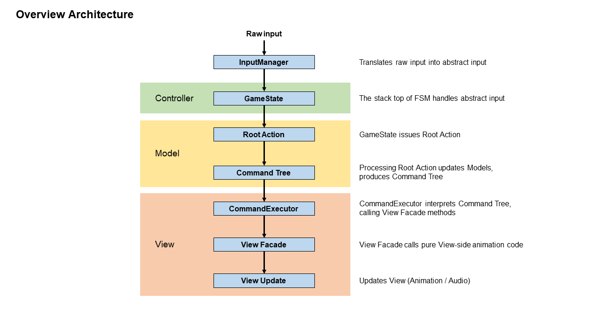
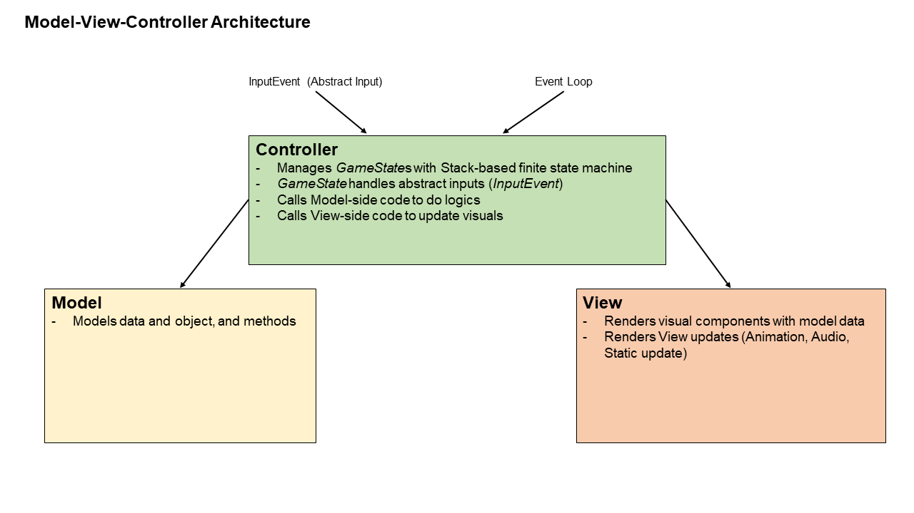
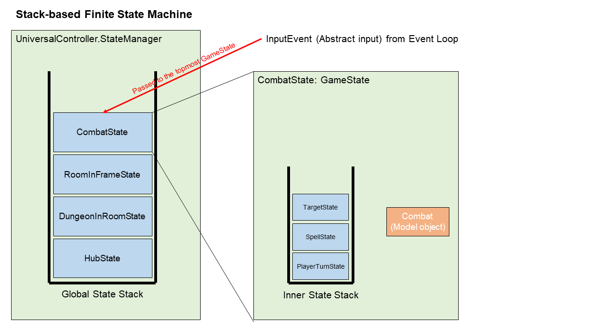
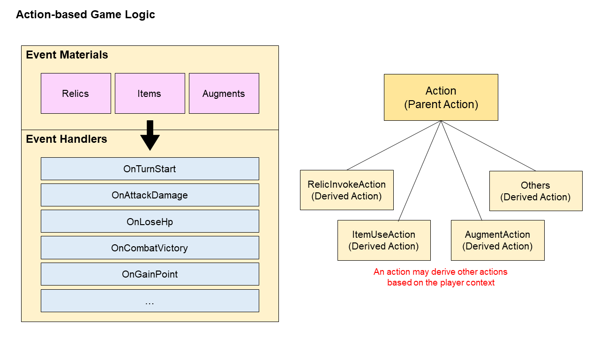
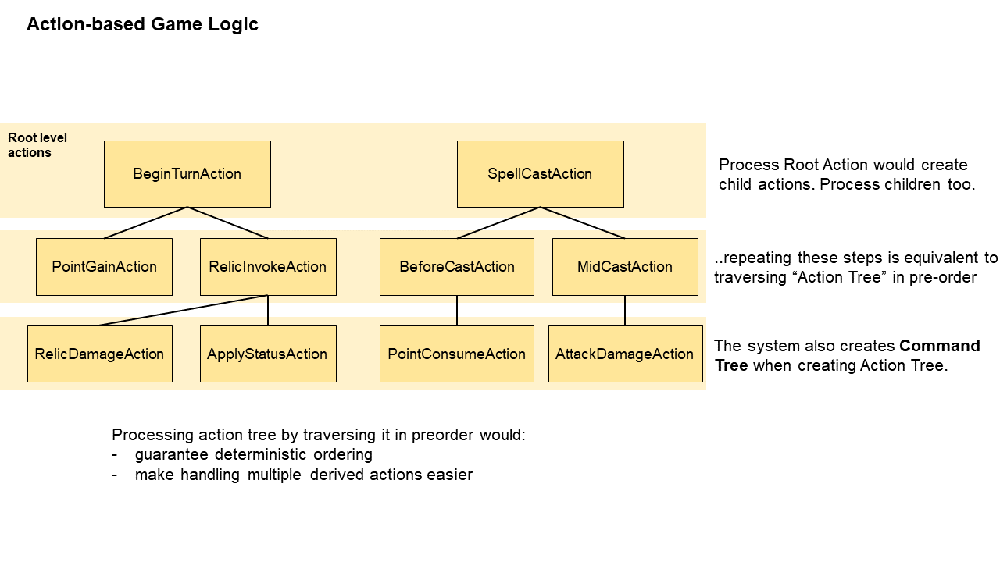
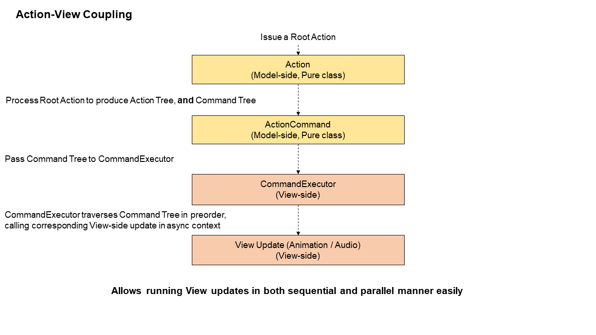
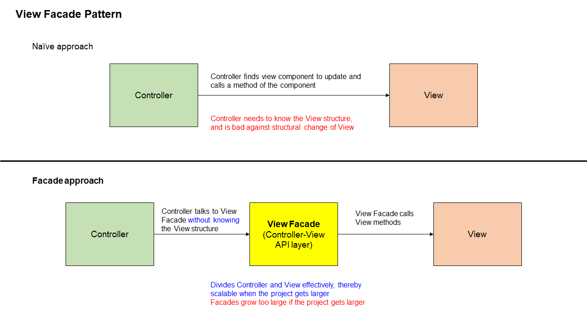
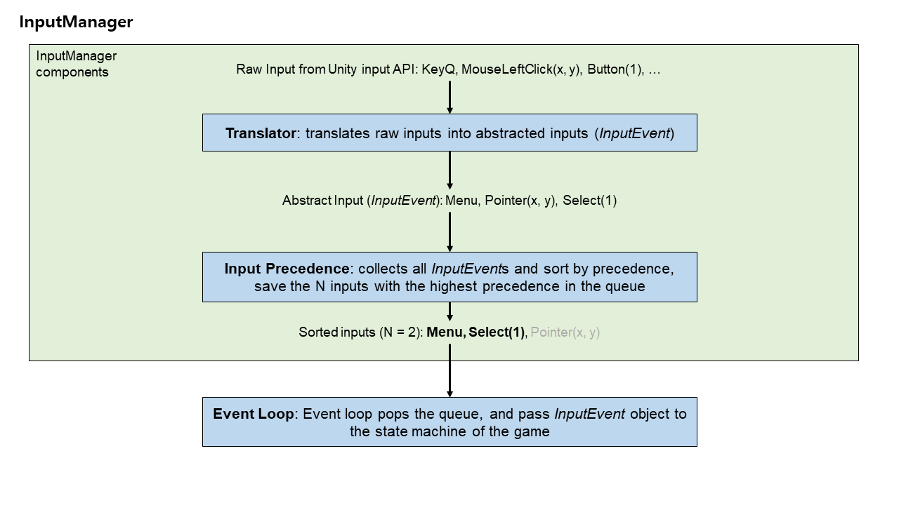
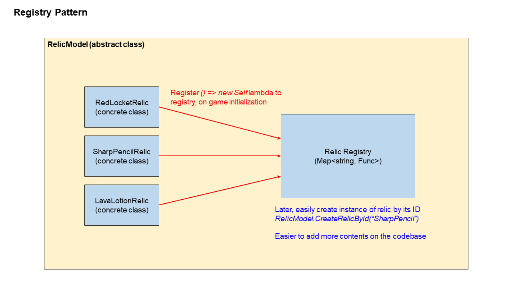

# Project - EXM

이 README는 제작 중인 팀 게임 프로젝트 EXM의 기술 및 설계를 다룹니다.

## 목차
- [프로젝트 개요](#개요)
- [게임 기획 개요](#게임-기획-개요)
- [아키텍쳐](#아키텍쳐)
- [기술 및 설계](#기술-및-설계)
    - [MVC 디자인 패턴](#1-model-view-controller-분리)
    - [스택 기반 FSM](#2-스택-기반-유한-상태-머신-stack-based-fsm)
    - [Action 기반 시스템](#3-action-기반-처리)
        - [연쇄 Action 처리](#31-연쇄-action-처리)
        - [Action-View 연결 처리](#32-action-view-연결-처리)
    - [View Facade 패턴](#4-view-facade-패턴)
    - [입력 추상화](#5-입력-추상화)
    - [Registry 패턴](#6-registry-패턴)
- [비고](#비고)

---

##### 기술 및 설계 핵심
- 트리를 활용한 Action 및 Action-View 연결 처리
- 스택 기반 유한 상태 머신을 통한 프로젝트 상태 관리
- View Facade를 통한 Controller-View API Layer 구현
- Input API Layer를 통해 멀티플랫폼 및 하드웨어의 확장성 확보

---

## 프로젝트 개요
이 프로젝트는 팀으로 진행한 상업용 게임 소프트웨어 프로젝트로, 턴제 기반 로그라이트 장르 게임을 제작합니다.
Unity 6 기반으로 제작하고 있으며, 코드 설계, 관리 및 구현을 모두 직접 진행했습니다.

---

## 게임 기획 개요
프로젝트가 다루는 게임의 장르는 턴제 기반 로그라이트입니다. 최대 4 명의 아군을 골라 파티를 짜고, 그 파티로 던전을 들어가 던전을 공략하는 방식입니다. 던전은 여러 개의 방으로 이루어져 있고, 방들은 서로 연결되어 있습니다. 
방들을 전부 공략해 마지막 층까지 도달하여 보스를 처치하면 던전을 클리어하는 방식입니다.

일반적인 로그라이크와 다른 로그라이'트'이기 때문에 플레이어는 게임에 패배해도 모든 것을 잃지 않습니다. 마을에서 파티를 강화하고, 아이템을 모아둘 수 있습니다.

---

## 아키텍쳐

이 프로젝트는 턴제 및 비실시간(Time-insensitive)인 시스템을 다루는데요, 이 구조는 
프로젝트의 핵심 아키텍쳐는 다음 그림으로 요약할 수 있습니다.



게임의 핵심은 Action으로, 대부분의 게임 내 상호작용이 Action을 통해 구현됩니다.
이 구조는 턴제 게임에서 중요한 "여러 효과의 결정론적(deterministic) 처리"를 Model-View-Controller 분리를 유지하면서도 쉽게 구현하게 해줍니다.

- InputManager가 하드웨어의 원시 입력을 추상 입력으로 변환합니다.
- Controller는 추상 입력을 받아 Root Action을 만듭니다.
- Root Action은 다른 Action을 파생시키며, 연쇄적으로 처리합니다. 동시에, Action의 파생 구조에 대응하는 Command Tree를 구축합니다.
- CommandExecutor는 Command Tree를 받아, 각 노드를 읽으며 노드의 유형에 해당하는 View-side 코드를 호출합니다.
- View-side 코드를 호출하면 Unity 엔진과 상호작용하여 애니메이션과 효과음 재생 등의 작업을 처리합니다.

---

## 기술 및 설계

---

### 1. Model-View-Controller 분리



어떤 프로젝트든 코드의 역할을 명확히 분리하여 작성하고 관리하는 것은 협업, 디버깅 및 유지 보수에 큰 도움을 준다고 생각합니다. 이 때문에 코드를 세 영역, Model-View-Controller로 분리했습니다.

- Model은 데이터와 객체를 표현하고, 메서드를 갖고 있습니다.
- View는 Unity 엔진과 직접 상호작용하는 영역으로, 시청각적 요소만을 관리합니다.
- Controller는 사용자 입력과 Event Loop와 상호작용합니다. 또한 게임의 현재 상태(GameState)를 관리하여, 상황에 맞게 적절한 Model 또는 View 영역의 코드를 호출합니다. *중재자(Mediator)* 역할을 합니다.

영역을 분리하지 않고 코드를 작성했던 제 이전 프로젝트들과는 달리, 영역의 분리만으로 코드의 가독성이 크게 개선되었으며, 팀원과 협업하기도 훨씬 쉬워짐을 느꼈습니다.

---

### 2. 스택 기반 유한 상태 머신 (Stack-based FSM)

게임과 같은 소프트웨어의 경우, 여러 상태를 두고 각 상태에 맞게 사용자의 입력을 처리하는 구조를 고안하는 것이 필요하다고 생각했습니다. 이에 잘 알려진 유한 상태 머신(FSM)을 채택하되, 스택 기반으로 구성하여 이전 상태로 돌아가는 것이 쉽도록 만들었습니다.



- `UniversalController`는 전역 싱글톤 변수로, 게임의 상태를 관리하는 스택을 내장하고 있습니다. 게임은 상황에 따라 이 전역 스택에 새로운 GameState를 Push하거나 Pop합니다.
- 각 GameState는 `OnEnter`, `OnExit`, `Update`, `HandleInput`등 상황에 따라 할 행동을 갖고 있습니다.
- 또한 GameState 내부에 자체 스택을 둘 수 있게 하는 **이중 스택** 구조를 고안했습니다. 이는 하나의 기능을 구현할 때, 그 기능을 통째로 묶어 관리하기 위함입니다.
    - 예시로, 그림 우측 `CombatState`는 `TargetState`, `SpellState`, `PlayerTurnState` 등의 하위 GameState를 갖습니다.
    - 평소에는 `CombatState`의 내부 스택에 새로운 GameState를 추가하되, `Combat`이 종료되면 `UniversalController`의 전역 스택에서 `CombatState`를 제거함으로써 `Combat`과 연관된 모든 GameState들을 쉽게 없앨 수 있습니다.

이중 스택 설계는 하나의 기능이 여러 GameState들을 쌓는 방식으로 구현되어야 할 때, 기능끼리 묶어 관리할 수 있도록 해줍니다. 그러나 어떤 상황에 어떤 스택(전역 또는 내부)을 사용할지 올바르게 코드를 작성하는 것이 실수하기 쉽다는 사소한 단점 또한 있습니다.

---

### 3. Action 기반 시스템

게임 내의 대부분의 상호작용을 Action으로 정의하고, 트리 구조로 구성하여 처리함으로써 결정론적 논리 처리 방식과 비동기적 View update의 올바른 순서 처리 방식을 고안했습니다

#### 3.1 연쇄 Action 처리

프로젝트가 다루는 시스템은 비실시간이며, 정해진 순서대로 작업을 처리하는 것이 매우 중요합니다. 이를 쉽게 처리하기 위해, 비슷한 다른 게임에서 사용하는 Action 구현을 가져왔습니다. 게임에서 여러 복잡한 논리가 적용되는 것들을 모두 Action으로 취급하여 처리하도록 하는 것입니다.

대부분의 상호작용을 Action으로 정의해 구현하면, 구현의 규칙이 단순해지고 같은 상황에서 언제나 같은 결과를 내는 결정론적(deterministic)인 구조를 만들 수 있습니다.



유물, 아이템, 증강 등 캐릭터를 강화하고 상황과 상호작용할 수 있는 요소(Event Material)들은 상황에 따른 행동 함수(Event Handler)를 갖습니다. 이는 단순한 공격 한 번에도 여러 연쇄적인 효과들이 꼬리에 꼬리를 물고 따라 붙을 수 있다는 뜻입니다.
이렇게 연쇄적으로 효과들이 따라 붙는 것들을 전부 Action으로 생각합니다. 예를 들면,
- 아이템을 사용하는 Action을 하면, (Parent Action)
    - 아이템을 사용할 때 발동하는 유물을 작동시키는 Action (RelicInvokeAction)
    - 아이템의 사용 효과가 실제로 적용되는 Action (ItemUseAction)
    - 아이템을 사용할 때 발동하는 증강을 작동시키는 Action (AugmentAction)
    - 기타 등등의 Action들이 연쇄적으로 **파생**됩니다.

이렇게 Action들이 계속해서 파생되는 구조는, 트리와 유사한 구조를 갖습니다. 다음 그림은 이런 Action이 처리되는 방법을 설명합니다.



- 사용자 입력 등으로 인해 최초로 Action이 생성되면(Root Action), 이 Action을 처리하면서 새로운 Action이 파생됩니다. 파생된 Action들을 현재 Action의 **자식** Action으로 취급합니다.
- 자식 Action을 처리합니다. 새로운 파생 Action들이 생성되면 반복합니다.
- 더 이상 파생되지 않을 때까지 반복합니다.

위 알고리즘은 트리를 preorder로 재귀 순회하는 방식과 유사합니다. 이 방법은 구현이 쉬우며 같은 환경에서 언제나 같은 실행 순서를 보장한다는 장점이 있습니다.

또한, Action을 처리하는 과정에서 *Command Tree*를 만듭니다. Action이 트리와 같은 구조를 가지는데, *Command Tree*는 이 Action의 트리 구조를 그대로 유지합니다.
다음은 Action과 *Command Tree*를 만드는 ActionCommand의 구현 예시입니다.

```cs
// Action interface
public interface ICombatAction 
{
    ActionCommand Apply(CombatModel combat);
}

// ActionCommand
public abstract class ActionCommand
{
    public List<List<ActionCommand>> Children = new();

    // Add child node at the given order
    public void AddChild(ActionCommand child, int order)
    {
        while (order >= Children.Count)
        {
            Children.Add(new());
        }

        Children[order].Add(child);
    }
}

// Example Action code
public class SpellCastAction : ICombatAction
{
    private readonly SpellModel _spell;
    private readonly EntityCombatElement _caster;
    private readonly Position _targetPos;

    public SpellCastAction(SpellModel spell, EntityCombatElement caster, Position targetPos)
    {
        _spell = spell;
        _caster = caster;
        _targetPos = targetPos;
    }

    public ActionCommand Apply(CombatModel combat)
    {
        // Recursively handle `derived` actions
        BeforeSpellCastAction beforeAction = new(_spell, _caster, _targetPos);
        MidSpellCastAction midAction = new(_spell, _caster, _targetPos);
        AfterSpellCastAction afterAction = new(_spell, _caster, _targetPos);

        // Create `Command` node
        SpellCastCommand command = new(_spell, _caster, _targetPos);
        
        // Add children nodes to create tree
        command.AddChild(beforeAction.Apply(combat), 0);
        command.AddChild(midAction.Apply(combat), 1);
        command.AddChild(afterAction.Apply(combat), 2);

        return command;
    }
}
```

ActionCommand의 구현을 잘 보면, 자식 노드를 `List<ActionCommand>` 가 아닌 `List<List<ActionCommand>>`의 2차원 배열로 사용했음을 볼 수 있습니다. 이는 ActionCommand가 View와 상호작용하는 방식 때문으로, 이어서 설명합니다.


#### 3.2 Action-View 연결 처리

게임의 대부분이 Action 기반으로 처리된다면, Action을 처리할 때 그에 알맞는 View update가 적절히 이루어져야 합니다. Action은 Model-side이므로 시간과 무관하게 처리 가능하지만, 애니메이션 및 오디오 등의 View update는 시간에 종속적이라는 점이 어려운 점입니다. 동기적으로 작동하는 Action과 달리 View update는 비동기적으로 작동하기 때문입니다.

이전에 Action을 만들 때 같이 만들어졌던 *Command Tree*를 사용해 이 문제를 해결하고자 했습니다.
- Action을 처리하면 Action이 트리를 preorder로 순회하는 것과 같은 순서로 처리되며, *Command Tree*(ActionCommand)를 만듭니다.
- ActionCommand는 CommandExecutor에게 전달됩니다.
- CommandExecutor는 적절한 View-side 코드를 호출해 애니메이션, 오디오 등의 시간이 동반된 View의 변화를 일으킵니다.



ActionCommand는 트리의 노드와 같은 형태로, 전술했듯 특이하게 자식이 2차원 배열로 구성되어 있습니다. 2차원 배열 형태는 여러 비동기적인 View의 변화를 직병렬적으로 모두 다룰 수 있게 해줍니다.
- CommandExecutor는 ActionCommand를 preorder로 순회하며 View update를 처리합니다.
- 노드의 순회 규칙은 자신 - 자식[0] - 자식[1] - ... - 자식[N - 1] 순으로 처리합니다. 이때 자신과 자식[0]은 동시에 시작합니다.
- 이 방식은 비동기적인 View update들을 병렬, 직렬 어느 방식으로든 다룰 수 있게 합니다.
    - 자식[i]에 속한 모든 View update가 **병렬**로 처리됩니다.
    - 자식[i]와 자식[i + 1]은 **직렬**로 순서대로 처리됩니다.

```cs
// ActionCommand
public abstract class ActionCommand
{
    public List<List<ActionCommand>> Children = new();

    // Add child node at the given order
    public void AddChild(ActionCommand child, int order)
    {
        while (order >= Children.Count)
        {
            Children.Add(new());
        }

        Children[order].Add(child);
    }
}

public abstract class CommandExecutor
{
    // Executes ActionCommand by traversing the tree in preorder
    public virtual async Task Execute(ActionCommand actionCommand)
    {
        // Run View update of self
        Task selfHandle = RunCommandAnimation(actionCommand);

        // At the same time, begin View updates of Children[i][0..j]
        foreach (List<ActionCommand> orderItems in actionCommand.Children)
        {
            // Await until View updates of Children[i][0..j] are all finished.
            await Task.WhenAll(
                orderItems.Select(child => Execute(child))
            );
        }

        // Await for View update of self.
        await selfHandle;
    }

    public async Task RunCommandAnimation(ActionCommand command)
    {
        Task animation = command switch
        {
            // Return some View-side Task with the given command type
        };

        await animation;
    }
}
```

Action만 쓰는게 아닌, ActionCommand를 따로 만든 이유는 다음의 두 가지가 있습니다.
- ActionCommand는 Model-side 코드로 Unity 종속성이 없고 Action에 비해 더 작은 크기를 갖습니다. View-side 코드가 해석할 수 있는 값만을 담은 데이터이기에 Model과 View가 서로에게 종속되는 상황을 없앱니다.
- ActionCommand 값을 저장해두면, CommandExecutor에게 다시 전달해 리플레이 혹은 애니메이션 재생 속도 변경 등의 다양한 기능을 추가하기 쉬워집니다.

초기에는 트리 구조가 아닌 비순환 유향 그래프(Directed Acyclic Graph, DAG)를 사용하려 했는데, View update의 선후관계를 명확히 표헌하기에 제격이라고 판단했기 때문입니다. 하지만 DAG의 선후관계 표현력이 좋음에도 불구하고 DAG를 생성하는 난이도가 너무나도 어렵고 복잡하다 생각했기에, 보다 간결한 구조인 트리를 최종 채택했습니다.

---

### 4. View Facade 패턴

Controller와 View가 상호작용하려면, Controller가 View의 함수들을 호출해야 합니다.
View의 코드들은 Unity GameObject의 구조와 유사한 구조를 갖고 있습니다. 예를 들어, 큰 UI 영역 안에 버튼이 하나 있으면, 영역과 버튼의 View Script는 아래와 같은 구조를 같습니다.

```cs
// UI 안에서 Button을 참조 가능.
public class CombatUIView : MonoBehaviour
{
    public SpellButtonView SpellButton;
}

```

Controller는 `CombatUIView`에 대한 참조를 갖고 View 코드를 호출할 수 있습니다. 그러나 이는 Controller가 View의 구조를 알아야 하는 방식이므로 아래와 같은 코드를 쓸 수 밖에 없게 됩니다.

###### 나쁜 코드 예시
```cs
// Controller-side code
public class CombatReadyState : GameState 
{
    private CombatUIView CombatUIView;

    private void OnConfirmInput() 
    {
        // VERY BAD, directly references view hierarchy
        CombatUIView.SpellButtonView.ButtonText.Blink();
        CombatUIView.SpellButtonView.ButtonShader.Fluctuate();
    }
}
```

이렇게 View의 구조를 Controller가 알아야 하는 구조적 문제를 해결하고자 View Facade 패턴을 채택했습니다. View Facade는 Controller와 View 사이의 API Layer 역할을 합니다.



기존의 View 구조를 알아야 했던 방식과 달리, View Facade가 중간자 역할을 하므로 더 이상 Controller는 View의 구조를 자세히 알 필요가 없게 됩니다. 또한 각 GameState가 View에 대한 참조를 갖고 있을 필요도 없게 됩니다.

###### 수정된 코드 예시
```cs
// Controller-side code
public class CombatReadyState : GameState 
{
    private CombatFacade CombatFacade;

    private void OnConfirmInput() 
    {
        // Better than before
        CombatFacade.ConfirmSpellButton();
    }
}

// Facade code (View-side)
public class CombatFacade 
{
    public CombatUIView CombatUIView;

    public void ConfirmSpellButton() {
        // Still a bit dirty, but it is in View-side
        CombatUIView.SpellButtonView.ButtonText.Blink();
        CombatUIView.SpellButtonView.ButtonShader.Fluctuate();
    }
}

```

이 방식은 Controller와 View의 독립성을 유지시켜 MVC 패턴을 잘 지킬 수 있게 도와줍니다. 그러나 View가 복잡해질수록 단일 Facade의 크기가 너무 커진다는 단점 또한 있습니다.
이 프로젝트에서는 게임의 규모가 작다 생각했고, 이에 Facade의 크기가 적정 선에서 유지될 것이라 예상해 Facade를 도입하기로 결정했습니다.

---

### 5. 입력 추상화

사용자 입력을 받으면 GameState가 반응해 적절한 작업을 하게 됩니다.
그러나 Unity의 Input API는 하드웨어의 입력을 그대로 인식합니다. 이 때문에 별다른 작업 없이 사용하면 게임의 플랫폼마다 다른 입력 방식을 처리하기 귀찮고, 키 설정 등의 편리한 기능을 만들 수 없으며, 동시 입력의 처리도 어렵습니다.

이 문제를 해결하기 위해, InputManager라는 전역 싱글톤 변수를 도입해 입력을 전담 처리하도록 했습니다. 구조는 다음 그림과 같습니다.



- Translator: 하드웨어로부터 오는 원시 입력을 *추상 입력*으로 바꿉니다. Translator에 키 설정 값을 줌으로써 편리하게 키 변경 등을 할 수 있게 하며, 멀티플랫폼을 지원하기 쉽게 합니다.
- Input Precedence: 한 프레임에 동시에 여러 *추상 입력*이 발생하면 이를 우선순위가 높은 순으로 `N` 개만 Queue에 저장합니다.
- Queue 처리: 이벤트 루프는 매 프레임마다 Queue front에 있는 *추상 입력*을 GameState에 전달합니다.

InputManager에게 입력을 모두 일임하면 GameState 코드를 작성하기 쉬워집니다. 플랫폼과 입력을 전부 신경 쓸 필요 없어져 오로지 추상 입력만 처리하면 되는 구조가 됩니다.

또한, InputManager에게 *추상 입력*을 전달하는 것은 하드웨어 입력으로만 가능한 것이 아니라 UI와 상호작용하는 것으로도 가능합니다.

```cs
public class SomeUIView: MonoBehaviour 
{
    [SerializeField] private Button _button;

    private void Awake()
    {
        _button.onClick.AddListener(() =>
        {
            // Send abstract input of type CONFIRM to InputManager
            InputManager.Instance.RaiseInput(InputEvent.Confirm());
        });
    }
}
```

이렇듯 InputManager는 멀티플랫폼 확장, 하드웨어 종속성 문제, 키 설정 문제 등을 손쉽게 해결해줍니다.


---

### 6. Registry 패턴

게임의 특성 상 같은 추상 클래스를 상속하는 자식 클래스가 많습니다. 예를 들어, *유물*을 표현하는 *RelicModel* 클래스가 있다면 실제 유물인 RedLocketRelic, SharpPencilRelic 등은 RelicModel을 상속하는 식입니다.

프로젝트의 컨텐츠가 지속적으로 추가될 것이라고 생각했기에, 기존 코드를 수정하지 않고도 쉽게 새 클래스를 추가할 수 있는 구조를 고민했습니다. 



추상 클래스의 내부에 registry를 준비하여, 자식 클래스를 생성하는 람다 함수를 담아두는 방식입니다.
자식 클래스는 static 생성자를 이용해 추상 클래스의 registry에 자기 자신을 생성하는 람다 함수를 등록하게 됩니다.

예시로 *유물*을 다루는 RelicModel의 간소화된 구현을 아래 코드를 통해 볼 수 있습니다.


```cs
public abstract class RelicModel
{
    // Registry that stores { id -> () => RelicModel } mappings
    private static readonly Dictionary<string, Func<RelicModel>> _registry = new();

    // Called by child classes (T)
    protected static void Register<T>(string id) where T : RelicModel, new()
    {
        // Stores lambda function that returns new instance of T
        _registry[id] = () => new T();
    }

    // Create a Relic by string id.
    // Usage: 
    //      RelicModel.CreateRelicById("RedLocket");
    public static RelicModel CreateRelicById(string id)
    {
        if (_registry.TryGetValue(id, out var creator))
            return creator();

        throw new IdNotFoundException($"Relic with id '{id}' not found.");
    }
}

public class RedLocketRelic : RelicModel
{
    private const string _id = "RedLocket";

    // Static constructor
    // Called only once when the class is referenced for the first time
    static RedLocketRelic()
    {
        // Register `RedLocketRelic` on registry of RelicModel
        Register<RedLocketRelic>(_id);
    }
}

```

이 구조를 택하면 새로운 자식 클래스를 추가하더라도 기존 코드의 수정이 전혀 필요없습니다. 단, 현재의 구현은 자식 클래스를 구별하는 수단이 string ID 뿐이기에 틀릴 가능성이 있다는 점과 수동으로 string을 관리해야 한다는 점 등의 한계점이 있습니다. 이는 string을 다른 것으로 대체하여 개선할 수 있다고 생각합니다.

---

## 비고

이 프로젝트는 상업용으로 계획되어 있기에, 소스 코드를 비공개로 유지하고 있습니다. 협의 시 제한된 영역에 한해 공개할 수 있습니다.

---